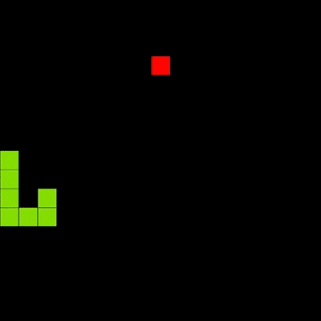

# Snake Game

Snake Game in browser made with p5js.  
This game is inspired by the original Snake Game.  

---

# Optimizations

This snake game is optimized for performance.
- Instead of a typical array, I used a linked list to represent the snake’s body.
- To simulate movement efficiently, I move the tail segment to the head position rather than shifting the entire body.
- I use a hash map to quickly check if the snake collides with its own body, enabling constant-time collision detection without iterating through the entire snake.

---

# How to play

You can play this game here: https://echolewron.github.io/snake_game/  
Use arrow keys to control the snake.
